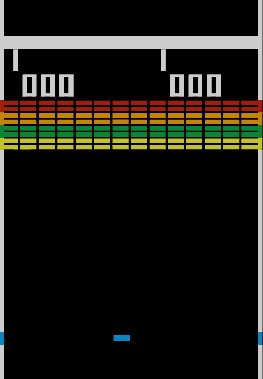

git 
**Overview**

This is a game that brings me back to my childhood.

In Breakout, a layer of bricks lines the top third of the screen and the goal is to destroy them all by repeatedly bouncing a ball off a paddle into them.

**User Stories**

As a user, I want the ability to...

* see eight rows of bricks with two rows each of a different color.
* See the color order from the bottom up is yellow, green, orange and red.
* Use a single ball and must knockout down as many bricks as possible by using the walls and/or the paddle below to hit the ball against the bricks and eliminate them.
* If the paddle misses the ball's rebound, they will lose a turn.
* have three turns to try to clear one screen of bricks.
* see yellow bricks earn one point each, green bricks earn three points, orange bricks earn five points and the top-level red bricks score seven points each.
* see the paddle shrinks to one-half its size after the ball has broken through the red row and hit the upper wall.
* see the ball speed increase at specific intervals: after four hits, after twelve hits, and after making contact with the orange and red rows.
* being able to see the highest score achievable for one player wich is 448; this is done by eliminating one screen of bricks.

**Bonus Stories(if time is available)**

* a better design on the layout
* display bricks with better graphics
* being able to play two screeens of bricks to add up to 896 points for the highest score.

**Wireframe**

